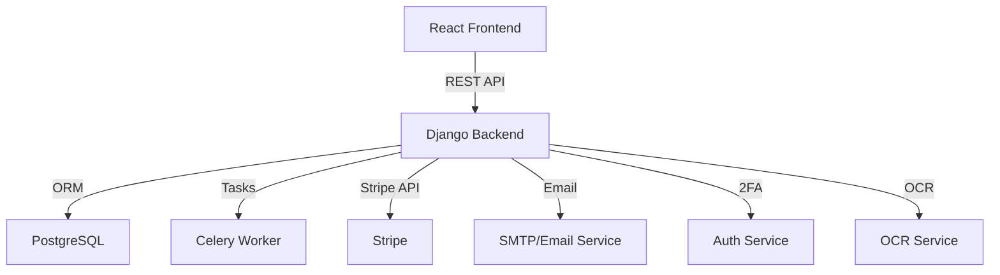

# InvoiceZen

InvoiceZen is a modern invoice automation app designed for freelancers and businesses. It streamlines time tracking, receipt management, invoice generation, and payment collection.

---

## Features

- **Time Tracker**
    - Manual and automatic time tracking for projects and tasks.

- **Receipt Management**
    - Upload receipts.
    - Automatic categorization using OCR.

- **Invoice Generator**
    - Create and customize invoices.
    - Download invoices as PDF.

- **Payments**
    - Stripe integration for direct client payments.

- **Recurring Invoices**
    - Schedule and send recurring invoices automatically.

- **Authentication & Security**
    - User login and registration.
    - Email verification.
    - Two-factor authentication (2FA).

---

## Tech Stack

- **Backend:** Django
- **Frontend:** React
- **Database:** PostgreSQL
- **Background Jobs:** Celery (for tasks like OCR, email, recurring invoices)
- **Payments:** Stripe API

---

## High-Level Architecture

---

## Modules Overview

- **Auth:** Login, registration, email verification, 2FA
- **Time Tracking:** Manual/automatic timers, project/task association
- **Receipts:** Upload, OCR processing, auto-categorization
- **Invoices:** Create, edit, PDF export, recurring scheduling
- **Payments:** Stripe integration, payment status tracking
- **Background Jobs:** Celery for OCR, email, recurring invoice dispatch

---

## Example User Flow

1. **Sign Up & Secure Account:** Register, verify email, enable 2FA.
2. **Track Time:** Start/stop timers or log time manually.
3. **Upload Receipts:** Snap/upload receipts, auto-categorized via OCR.
4. **Generate Invoice:** Select billable hours/expenses, generate invoice, download PDF.
5. **Send & Get Paid:** Email invoice to client, client pays via Stripe link.
6. **Automate:** Set up recurring invoices for repeat clients.

---

## Getting Started

1. **Backend:** Django project with REST API, Celery, Stripe, OCR integration.
2. **Frontend:** React app with authentication, dashboard, invoice builder.
3. **Database:** PostgreSQL for data storage.
4. **Deployment:** Dockerize services for easy deployment.

---

## License

MIT License
